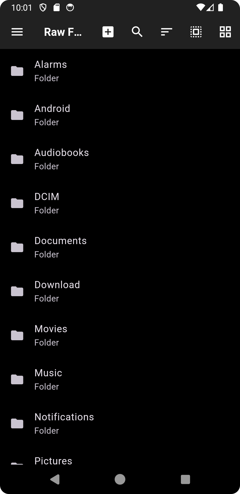

# Raw File Manager

-orange.svg)
-purple.svg)

---

## Overview

**Raw File Manager** is a powerful, user-friendly, and feature-rich file management app for Android devices. Designed to work seamlessly across all Android versions from **5.0 (Lollipop)** to **Android 14**, this app provides an intuitive interface for managing your files and folders with ease. Whether you're a casual user or a developer, Raw File Manager has everything you need to organize, edit, and manage your files effectively.

---

## Features

- **Create Files and Folders**: Easily create new files or folders in any directory.
- **Delete Files and Folders**: Delete single or multiple files/folders with confirmation options.
- **Move Files and Folders**: Move files or folders to different locations effortlessly.
- **Zip/Unzip Support**: Compress files into ZIP archives or extract them with ease.
- **Recycle Bin**: Recover accidentally deleted files from the Recycle Bin.
- **File and Folder Search**: Quickly find files or folders using the search functionality.
- **Sorting Options**: Sort files and folders by name, date, size, or type.
- **Built-in Text Editor**: Edit text files directly within the app.
- **Intuitive Navigation Bar**: Navigate through directories with a clean and simple navigation bar.
- **Home Screen**: Access frequently used directories and features from the home screen.

---

## Screenshots

### Home Screen

*The main interface for quick access to your files and folders.*

### Navigation Bar

*Easily navigate through directories with the intuitive navigation bar.*

### File and Folder Creation

*Create new files or folders in any directory.*

### Multiple Deletions

*Select and delete multiple files or folders at once.*

### File Actions

*Perform actions like delete, move, zip, and more.*

### Recycle Bin

*Recover deleted files from the Recycle Bin.*

### Search Functionality

*Quickly find files or folders using the search feature.*

### Sorting Options

*Sort files and folders by name, date, size, or type.*

### Built-in Text Editor

*Edit text files directly within the app.*

### Zip/Unzip Features

*Compress files into ZIP archives or extract them with ease.*

---

## Installation

### Option 1: Install the APK
1. Download the latest APK from the [Releases](https://github.com/Anonym0usWork1221/raw-file-manager/releases) section.
2. Enable "Install from Unknown Sources" in your device settings.
3. Open the downloaded APK and follow the installation prompts.

### Option 2: Build from Source
1. Clone the repository:
   bash
   git clone https://github.com/Anonym0usWork1221/raw-file-manager.git

2. Open the project in Android Studio.
3. Sync the Gradle files and ensure all dependencies are installed.
4. Connect your Android device or start an emulator.
5. Build and run the app.

---

## Usage Guide

### Key Features
- **Creating Files/Folders**: Tap the "+" icon on the home screen to create a new file or folder.
- **Deleting Files/Folders**: Long-press on a file or folder to select it, then tap the delete icon.
- **Moving Files/Folders**: Long-press to select, then choose the "Move" option from the actions menu.
- **Zip/Unzip**: Select files or folders, then choose "Zip" or "Unzip" from the actions menu.
- **Recycle Bin**: Access deleted files from the Recycle Bin and restore or permanently delete them.
- **Search**: Use the search bar to find files or folders by name.
- **Sorting**: Tap the sort icon to organize files by name, date, size, or type.
- **Text Editor**: Open a text file to edit its content directly within the app.

---

## Developer Guide

### Prerequisites
- **Android Studio**: Latest version
- **Flutter SDK**: Installed and configured
- **Dependencies**: Ensure the following dependencies are added in `pubspec.yaml`:
    - `permission_handler`
    - `path`
    - `open_file`
    - `share_plus`
    - `archive`
    - `device_info_plus`
    - `file_picker`

### Cloning the Repository
bash
git clone https://github.com/Anonym0usWork1221/raw-file-manager.git
cd raw-file-manager

### Building the App
1. Open the project in Android Studio.
2. Sync Gradle and ensure all dependencies are installed.
3. Run the app on an emulator or connected device.

### Project Structure
- **`main.dart`**: Entry point of the app.
- **Pages**: Contains UI pages like `home_page.dart`, `recycle_bin_page.dart`, etc.
- **Services**: Includes utility services like `deletion_service.dart`.
- **Widgets**: Reusable UI components.
- **Utils**: Helper functions for file operations and encryption.

### Contributing
1. Fork the repository.
2. Create a new branch for your feature or bug fix:
   bash
   git checkout -b feature-name

3. Commit your changes:
   bash
   git commit -m "Add feature-name"

4. Push to your fork and create a pull request.

---

## Contributing

We welcome contributions from the community!
Please read our [Contributing Guidelines](https://github.com/Anonym0usWork1221/raw-file-manager/CONTRIBUTING.md) before submitting a pull request.

---

## License

This project is licensed under the MIT License. See the [LICENSE](LICENSE) file for details.

---

## Contact / Community

- **GitHub Issues**: [Report issues](https://github.com/Anonym0usWork1221/raw-file-manager/issues)
- **Email**: abdulmoez123456789@gmail.com

---